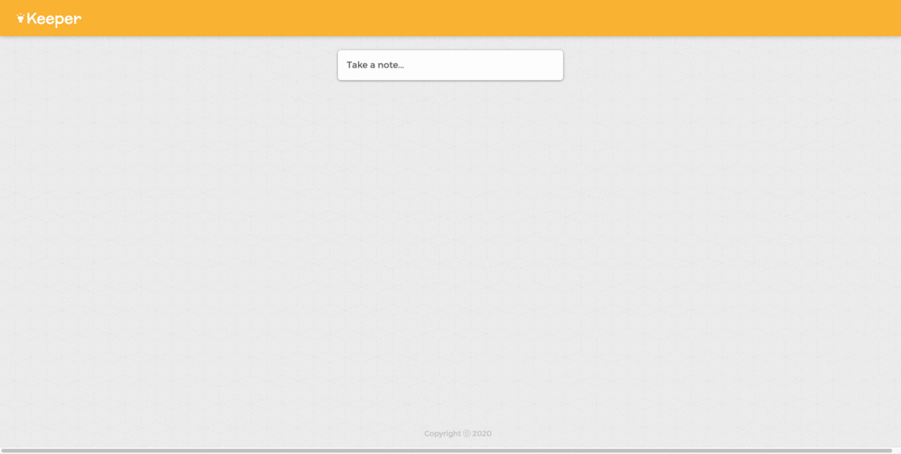

# Keeper App

<ul>
  <li>Built a web application that allows users to post and delete notes.</li>
  <li>Primarily (about 90%) used React.js to perform the frontend design.</li>
  <li>Utilized: React.js, JavaScript, Material-UI, HTML/CSS</li>
</ul>

<b>Demo:</b>

